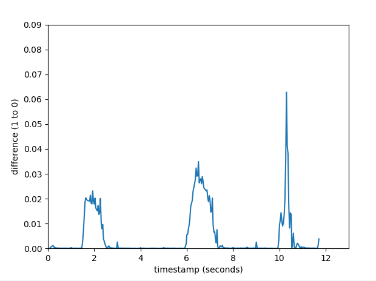

# Motion detection.
- This project is probably the best one I've done in the 2022 [Estimated date of completion: January 2022]. An unoriginal concept but a totally authentic implementation by me.
- What it does is it takes a video as an argument and processes all the pixels of all the frames to compute the magnitude of difference(between 0 and 1 `0:no difference` and `1:exactly opposite`) between every frame.
- The processed information, which is essentially just a dictionary with all the magnitudes and the timestamps is saved into a separate file. From this file containing all the data (`.json`), all the information can be loaded using another command and is then relayed onto the command-line window in a formatted way.  
- A graph gets generated with all those 2 pairs of data plotted along the x and y axis. This lets you know at which point of the video motion is present by observing the spikes in the graph. A flat line indicates lesser change in the video - no motion.
## A glimpse:  
Data visualization:  
  

Frame-by-frame processing done prior to achieve the above:  
  
Both these videos are sped up, the processing takes many many minutes.    

# Requirements:
- Python 3.9+
- Git (optional)
  
# Installation and use.
## Installing source code + dependencies
```bash
git clone "MotionDetection"
cd "MotionDetection"
python -m pip install -r requirements.txt
```
- If you don't have git you can download the source code from the github page (or look out for the releases section) by clicking on the download button.

## Processing a video
Lets assume the path to your video to be `videopath` (the whole path or relative)
```bash
python main.py vid videopath
```
the above will process all the pixels of all the frames in the video and find out the magnitude of the difference between every two frames.  
A json file with all the processed data gets stored in the `log/` folder for later.  
  
## Plotting the data in a Graph/Data visualization
- Lets assume that the filename (including the extension)(not the fullpath used before) of the video you just processed is `filename`
example `filename`: `myvideo.mp4`
```bash
python main.py showdata filename
```
The above command loads the json file that was saved with the filename your video and relays that information onto the command-line window after which a separate window gets created that displays the graph.  
Example graph:  
  
- Notice the axes. 
    - The y-axis denotes the magnitude of difference (from 0 to 1).
    - The x-axis denotes the time in seconds (0 to total duration of video).

## Processing two photos
- This feature is irrevelant to the actual project itself but if you have two seperate photos of the same dimensions, you can use the following command to find the magnitude of difference between two photos.
Assuming that the filepaths of the two files are `filepath1` and `filepath2`:
```bash
python main.py img filepath1 filepath2
```
## Command arguments
format: `[type] [filepath(s)]`
| type | filepath(s)| details |
|:----:|:----------:|:--------|
| vid  | videopath   | a single argument which is the fullpath of the video |
| img  | imagepath1 imagepath2 | two arguments for 2 filepaths of 2 images |
| showdata | filename | a single argument which is a the filename of the video |
# Theory
- The following is a detailed explanation of how the entire process of calculating works
- A single frame and the one that follows it is taken first.
- Every single pixel of these two frames are compared one after the other 
- A frame may contain hundreds of thousands or even millions of pixels and a video may contain several thousand frames based on the fps, duration and resolution of the video. The number of calculations done is very difficult to comprehend.
- The difference between the rgb values a pixel from the 1st frame and a pixel from the 2nd frame at exact coordinates is calculated. (eg: pixel `(x=234, y=456)` of the first frame is compared to `(x=234, y=456)` of the next frame)
- example: if the rgb values of the pixel located at `(10, 34)` of two frames are: `(255, 134, 12)` and `(91, 42, 21)`, the difference would be calculated as `((255-91)+(134-42)+(12-21))/3 = 82.3`. A Negative value may be obtained but the absolute value is taken.
-  Since every colour visible to the human eye (28 million shades or so) can be represented as a combination of various intensities of red blue and green (`0-255` based on the intensity of the three colours), we are findind the sum of all three differences and dividing by 3 to get the mean colour difference of two pixels [shown in the above example].
eg: a black pixel and a white pixel yields a difference of 255 wheres a red and orange pixel yields a difference of less than 100. Identical pixels yield a difference of 0.
- This mean difference is divided by 255 to get the magnitude of difference of two pixels (since the difference of colour can range from 0 (no difference) and 255 (most difference) eg: `0.913`, `0.243`
- The pixels are gone through one after the other from left to right and then on the next row until the entire frame is processed with the next frame.
- The magnitude of differences of all the pixels of the two frames are added up and divided by the number of pixels in a frame which is a constant number throughout a video (the average difference of colour of two frames). By doing so we obtain a number which represents how much a frame has changed from the previous frame.
- All the above calculations are then done between the 2nd and 3rd frame, then the 3rd and 4th frame, then the 4th and 5th frame and so on until the entire video is processed.
- Finally we are left with a list of magnitudes which we can associate with the timestamp of a video and then plot in a bar graph to show a line that may spike or stay flat based on where and by how much a motion is observed in a video. Even if a video is still, a poor camera may produce video that flickers a lot (especially when shot in the dark), this may slightly interfere in the graph, but big differences are stil prominently visible.

- The above calculations seem lengthy but since the same process is repeated for every pixel of every frame, I was able to define all the calculations in less than 20 lines of code. [Click here]() to check it out
# Libraries used
| library name | Purpose |
|:------------:|:-------:|
| matplotlib   | generating graphs that help visualize   | 
| numpy        | Processing large amounts of numbers     |
| opencv       | Reading a video file and its contents   |
| Pillow       | Reading the contents of individual frames |
| json         | Reading and writing data into json files |

# Limitations:
- The amount of individual calculations done on a video is very high and it takes a ridiculous amount of time to process an entire video. 
- For instance, the example video I used in the gif above is only 11-12 seconds long and shot at a very low resolution of 640x480. That's only 307200 pixels each for every frame. And with the frame-rate being just 30 per second for that video, the total number of frames is just 352. (That's under 109 million pixels total). The total time taken for processing and saving the data was more than 10 minutes. Imagine doing the same with a video that's a couple of minutes long and shot in 60fps with a resolution of 720p or 1080p or god-forbid 4k.
The time taken to process the whole video would exponentially increase.
- I should have just used a faster language like C++ for doing the same thing but my knowledge of that language is sub-par. Maybe I should just write more memory efficient code, that's for you to point out in the issues section of the github repository.


